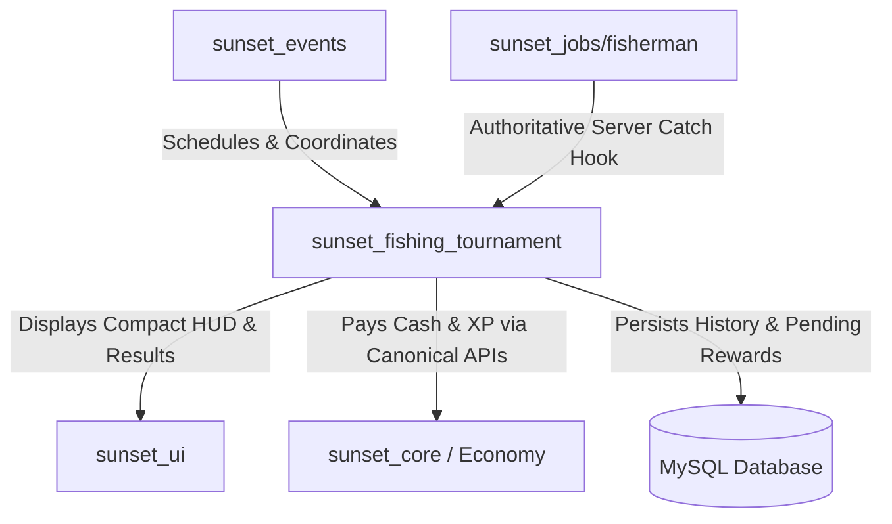
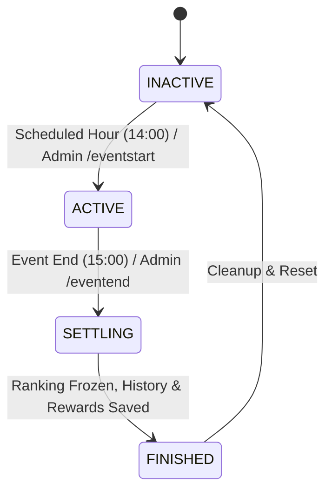

# Fishing Tournament System Architecture & Technical Specification

## Overview

The SunsetMP **Fishing Tournament** is a server-authoritative, recurring competitive RPG event. Players gather at the Paleto Bay fishing pier during the scheduled tournament window, join the competition, and compete to catch the highest **total fish weight** in kilograms.

---

## 1. Clear Resource Ownership & Architecture

The Fishing Tournament architecture separates responsibilities cleanly across five core domains:

| Domain | Resource | Core Responsibilities |
|---|---|---|
| **Scheduler & Lifecycle Coordinator** | `sunset_events` | Schedules daily event window (14:00 - 15:00), announces globally, generates stable instance ID (`fishing_tournament:YYYY-MM-DD:14`), provides world blip. Does **not** pay generic rewards. |
| **Tournament Authority** | `sunset_fishing_tournament` | Owns tournament state machine (`INACTIVE`, `ACTIVE`, `SETTLING`, `FINISHED`), explicit participant registration by character ID, score tracking, deterministic ranking, qualification checks, idempotency, and results broadcasting. |
| **Fisherman Gameplay Domain** | `sunset_jobs/server/fisherman.lua` | Controls rod tiers, bait tiers, minigame validation, catch chance, fish weight/rarity generation, and inventory `AddItem`. Fires server-internal event `sunset:fishing:caught` strictly **after** `AddItem` succeeds. |
| **User Interface** | `sunset_ui` | Displays glassmorphic live compact tournament HUD (`#fishing-tournament-hud`) and official podium results modal (`#fishing-tournament-results`). |
| **Economy Authority** | `sunset_core` | Grants authoritative cash and XP to winners via `exports.sunset_core:AddMoney` and `exports.sunset_core:AddXP`. |

---

## 2. Tournament Lifecycle & State Machine

1. **`INACTIVE`**: No tournament in progress. Joining and scoring are blocked.
2. **`ACTIVE`**: Tournament is open. Players within 45m of Paleto pier press `[E]` to register. Successful fish catches made *after* joining increment total weight.
3. **`SETTLING`**: End trigger initiates settlement. Score mutations and new joins are immediately locked to prevent race conditions. Deterministic sorting and qualification filters run once.
4. **`FINISHED`**: Results modal broadcasted to players; top 3 rewards distributed or queued in MySQL; memory reset after grace period.

---

## 3. Server-Authoritative Scoring & Win Condition

- **Primary Metric**: **Total catch weight in kilograms** caught during the active tournament window.
- **Client Security**: Clients **never** submit catch weights, items, or scores over the network. Score updates originate exclusively from the server-side `sunset_jobs` callback after successful inventory addition.
- **Integer Weight Representation**: To eliminate floating-point sorting jitter and cross-platform precision anomalies, weights are internally converted and summed as integer hectograms (`w10 = round(kg * 10)`).
  - Example: A `12.34 kg` catch becomes `123` internal units.

---

## 4. Deterministic 5-Level Tie Breaker

Winners are sorted deterministically without relying on random or unordered table iteration:

1. **Highest Total Catch Weight** (`totalWeight10` descending)
2. **Highest Single Fish Weight** (`biggestFishWeight10` descending)
3. **Highest Fish Count** (`fishCount` descending)
4. **Earliest Last Catch Timestamp** (`lastCatchAt` ascending — earlier completion wins)
5. **Character ID Fallback** (`charId` ascending — deterministic tie resolution)

---

## 5. Qualification Threshold

- **Requirement**: Configured via `minFish = 3`.
- A participant with fewer than 3 catches appears on the live leaderboard as `NOT QUALIFIED` (e.g., `1 / 3 fish`).
- Once their 3rd fish is landed, status transitions to `QUALIFIED`.
- **Placement Rewards**: Only qualified participants can win 1st, 2nd, or 3rd place placement rewards. If only 1 player qualifies, they receive 1st place; unqualified players never receive unearned placement payouts.

---

## 6. Rewards & Offline Idempotency

### Reward Table (Configurable in `shared/config.lua`)
- **1st Place**: `$15,000` Cash + `500` XP
- **2nd Place**: `$7,500` Cash + `250` XP
- **3rd Place**: `$3,000` Cash + `100` XP

### Database Schema & Offline Winner Guarantee
Two MySQL tables back the system:
1. `fishing_tournament_rewards`: Unique constraint on `(tournament_id, character_id)`.
   - If the winner is online: Cash and XP are granted immediately, `claimed_at = NOW()`.
   - If the winner disconnected before event end: Row is inserted with `claimed_at = NULL`.
   - When the player selects their character on reconnect, `sunset:server:characterSelected` automatically claims pending rewards and notifies the player.
2. `fishing_tournament_history`: Preserves full tournament archives for statistics and admin audit.

---

## 7. Daily Scheduler & Mid-Window Recovery

- **Date-Keyed Daily Execution**: Daily event tracking uses `YYYY-MM-DD:fishing_tournament:14` rather than raw hour numbers, ensuring the tournament reliably triggers every single day.
- **Mid-Window Recovery**: If the server or `sunset_events` restarts at 14:25 during the 14:00–15:00 window, the scheduler resumes the tournament with the remaining 35 minutes instead of restarting a full 60-minute cycle or failing to start.
- **Post-Window Guard**: If the server starts at 15:20 (after the 14:00–15:00 window), missed events are not inappropriately triggered.

---

## 8. User Interface Integration

- **Design Standard**: Fully integrated into the glassmorphic `sunset_ui` design system.
- **Compact Live HUD**:
  - Displays Player Rank, Total Weight (KG), Current Leader & Weight, Fish Count, Biggest Catch, and Remaining Time.
  - Updates via event-driven throttled broadcasts (1.5s interval).
- **Official Results Podium**:
  - Displays top 3 winners with gold, silver, and bronze badges, catch stats, and prize totals.
  - Summarizes local player's final placement and qualification status.
  - Supports dismissal via click or `Escape` key.

---

## 9. Admin & Developer Diagnostic Commands

All commands are restricted to server console and authenticated administrators:

| Command | Usage | Description |
|---|---|---|
| `/eventstart fishing_tournament [duration] [test]` | `/eventstart fishing_tournament 180 test` | Starts a manual tournament with custom duration (in seconds). When `test` is specified, placement money/XP payouts are bypassed for dev safety. |
| `/eventend` | `/eventend` | Ends and settles the active tournament immediately. |
| `/fishtournamentdebug` | `/fishtournamentdebug` | Dumps current state, instance ID, remaining seconds, participant counts, qualification counts, and top 5 leaderboard stats without exposing private player identifiers. |
