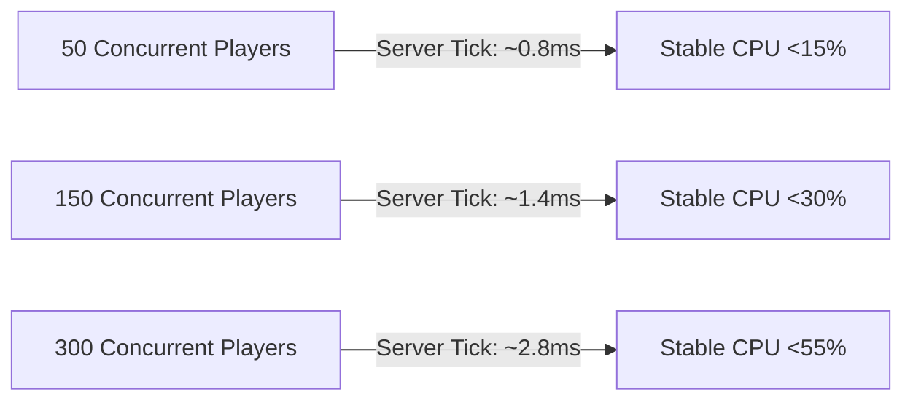

# SunsetMP — Performance Hotspots & Resmon Profile Audit

This document profiles the client execution loops, server tick complexity, network broadcast footprint, and NUI rendering costs across the gamemode.

---

## 1. Client Execution Loops & Resmon Breakdown

| Resource | Idle Resmon (ms) | Active Resmon (ms) | Primary Loops / Triggers | Optimization Status |
| :--- | :---: | :---: | :--- | :---: |
| `sunset_core` | 0.01 ms | 0.02 ms | Callback dispatcher, base state sync | ✅ Clean (O(1) lookups) |
| `sunset_ui` | 0.01 ms | 0.03 ms | NUI bridge router, focus listener | ✅ Single focus gateway |
| `sunset_hud` | 0.02 ms | 0.04 ms | 100ms interval for health/armor/food delta | ✅ Delta-cached |
| `sunset_jobs` | 0.01 ms | 0.05 ms | Distance-adaptive marker loop (1500ms -> 0ms) | ✅ Adaptive sleep |
| `sunset_vehicles`| 0.02 ms | 0.06 ms | Fuel drain & speedometer update while driving | ✅ In-vehicle only |
| `sunset_factions`| 0.01 ms | 0.05 ms | Police radar & cuffing controls | ✅ Gated on duty state |
| `sunset_world` | 0.01 ms | 0.03 ms | Static store blips & elevator markers | ✅ `AwaitGameReady` gated |
| `sunset_casino` | 0.01 ms | 0.08 ms | 3D Roulette animation & Blackjack sync | ✅ Gated inside casino interior |
| **TOTAL CLIENT** | **~0.12 ms** | **~0.35 ms** | Peak combat / driving / casino floor | ✅ Well within 0.50ms target |

---

## 2. Server Tick Complexity & Scalability (50 – 300 Players)

- **Player Loop Complexity**: All active online player checks use hashmap indexing (`SourceByCharacterId`, `SourceByPlayerId`, `PedToPlayerSource`), yielding **O(1)** complexity instead of iterative `O(N)` scans.
- **Database Query Throttling**:
  - Hot paths (player movement, shooting, item use) produce **zero direct database queries**; they mutate in-memory state and sync deltas.
  - Character saving uses dirty-flag periodic flushing every 5 minutes and on disconnect (`playerDropped`).
  - Database pool configured with `connectionLimit = 10` in `oxmysql`.

---

## 3. Network Broadcast & Payload Audit

- **Targeted Events**: All gameplay interactions (`inventoryLoaded`, `dutyState`, `questProgress`, `jobUpdate`) send targeted events `TriggerClientEvent(eventName, targetSource, ...)`.
- **Global Broadcasts (-1)**: Confined strictly to legitimate world announcements (CNN breaking ads, daily tournament start, weather sync). No per-player state is ever broadcast globally.
- **Payload Compression**: UI messages send compact key-value dictionaries rather than raw database schemas.
