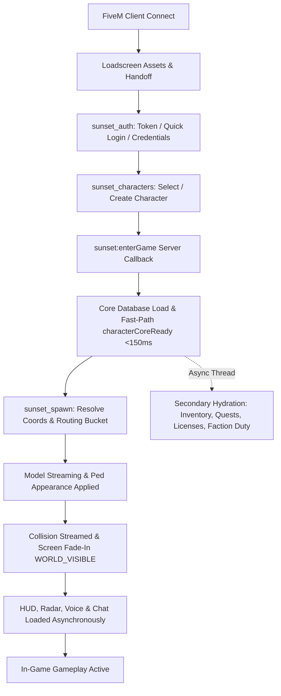

# SunsetMP — Complete Player Journey & Lifecycle Flow

This document maps the exact technical path of a player from FiveM connection to world immersion, progression milestones, death/reconnect, and disconnect.

---

## 1. Step-by-Step Technical Lifecycle

| Step | Trigger / Native | State Owner | Required Server Data | Required Client Data | Fallback / Timeout | Idempotent? |
| :--- | :--- | :--- | :--- | :--- | :--- | :---: |
| **1. Connect & Loadscreen** | Native FiveM handoff | FiveM / Loadscreen CEF | Server endpoints, build fingerprint | Local assets, CEF cache | 60s FiveM watchdog | Yes |
| **2. Authentication** | `sunset:authQuickLogin` or `sunset:authLogin` | `sunset_auth` server | Token / Password hash, Ban check | Machine hardware token / HWID | Show Auth UI modal | Yes |
| **3. Character Selection** | `sunset:getCharacters` | `sunset_characters` server | Character rows by `player_id` | Account ID | Character Creation screen if count = 0 | Yes |
| **4. Character Creation (New)** | `sunset:createCharacter` | `sunset_characters` server | First/Last name, age, gender, genetics | Creator form data | Error modal on duplicate name | Yes |
| **5. Core Entry (`enterGame`)** | `Sunset.AwaitCallback('sunset:enterGame')` | `sunset_core` server | Character DB row, last played update | Selected `characterId` | 4000ms timeout -> Retry prompt | Yes |
| **6. Spawn Resolution** | `Sunset.AwaitCallback('sunset:spawn:prepareBucket')` | `sunset_spawn` server | Last coordinates or default arrival spawn | Selected spawn type | Default spawn: Los Santos Arrivals | Yes |
| **7. Model & Appearance** | `RequestModelSafe` -> `SetPlayerModel` | `sunset_appearance` client | Character model hash & skin JSON | Spawned Ped ID | Default fallback: `mp_m_freemode_01` | Yes |
| **8. World & Collision** | `RequestCollisionAtCoord` -> `DoScreenFadeIn` | `sunset_spawn` client | Target Vector3 coordinates | Camera handle | Max 800ms collision stream wait | Yes |
| **9. Secondary Hydration** | `sunset:server:characterSelected` (Async Thread) | Respective resources | Inventory DB, Quest rows, Licenses, Factions | Character ID | Loads in background; direct DB fallback | Yes |
| **10. UI & Gameplay Activation** | Async events `sunset_ui:Send` | `sunset_ui` client | HUD initial values, Chat channels | Active PlayerPed | Resilient against individual UI module failures | Yes |

---

## 2. Brand New Player (First 30 Minutes Experience)

1. **Initial Spawning**:
   - Location: Los Santos International Arrivals (`vector3(-1037.7, -2737.8, 20.169)`).
   - Starting Capital: **$5,000 Cash** and **$10,000 Bank Account**.
   - Starting Inventory: Identification Card (ID), Cell Phone, GPS Navigation Device, 2x Bottled Water, 2x Sandwich.
   - Immediate Vehicles: Access to public bicycle rentals ($50) and municipal metro/bus stops.

2. **First Objectives & Guided Quests**:
   - **Quest 1: "Welcome to Los Santos"**:
     - Objective: Visit the City Hall (DMV) to register for a Driving License.
     - Reward: $500 Cash, 50 XP, Respect +10.
   - **Quest 2: "First Honest Day's Work"**:
     - Objective: Travel to the Job Center, select a starting job (Courier or Fisherman), and complete 1 shift.
     - Reward: $1,200 Bonus, 100 XP.

3. **Accessible Systems at Level 1**:
   - Jobs: Courier, Fisherman, Garbage Collector (no license required for assistant).
   - Commerce: 24/7 convenience stores, ATM banking, public fishing spots, low-tier clothing stores.
   - Social: Global chat (`/ooc`, `/me`, `/do`), cell phone messaging, player interactions (`[G]` menu).

---

## 3. Death, Incarceration & Reconnect Lifecycle

- **Downed State**: 300-second bleed-out timer. If no EMS revives in time, auto-respawn at Pillbox Hill Hospital with $500 emergency medical fee.
- **Police Arrest & Jail**: Persistent jail sentence stored in `character_jail` with countdown based on real playtime minutes. Reconnecting restores exact remaining jail sentence.
- **Crash / Reconnect Resilience**:
  - If a player crashes during an active job shift, the server preserves the session for up to 5 minutes, allowing seamless reattachment upon login without losing progress.
