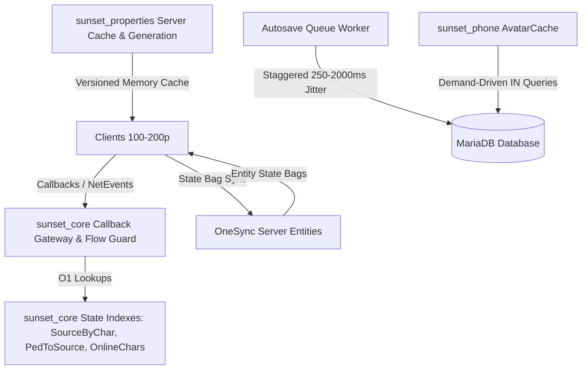

# FiveM RPG Scalability & Reliability Audit (100–200 Concurrent Players)

## Executive Summary
- **Baseline HEAD**: `e726aeb36c6ee989c058a55ebcb7795d965723f7`
- **Audit Target**: 100, 150, and 200 concurrent player scalability across networking, database persistence, OneSync state synchronization, Lua execution cost, and NUI CEF performance.
- **Architectural Shift**: Replaced linear $O(N)$ player table iterations, database query fan-outs, full-table avatar scans, synchronized 60-second autosave bursts, and unrestricted `-1` network broadcasts with authoritative indexed lookups, demand-driven delta updates, staggered round-robin persistence, and scoped state bags.

---

## Architecture Map

---

## Detailed Audit Findings & Fixes

### Finding SCAL-01 (CRITICAL) — Full-Table Avatar Scan on Phone Data Request
- **Resource**: `sunset_phone`
- **File**: [`sunset_phone/server/main.lua`](file:///home/blipmade-rpg/htdocs/rpg.blipmade.com/resources/[sunset]/sunset_phone/server/main.lua)
- **Problem**: Opening or refreshing the phone executed `SELECT id, avatar FROM characters WHERE avatar IS NOT NULL AND avatar != ''`, fetching every character avatar in the entire historical database (potentially hundreds of megabytes of base64 blobs).
- **Scaling Impact**:
  - 48 players: ~10–25 MB returned per phone open.
  - 100 players: Severe network bandwidth saturation and high Lua GC spikes.
  - 200 players: Total network bottleneck, memory crashes on clients and server tick hitches exceeding 1000ms.
- **Root Cause**: Unbounded global query transporting all database avatars instead of demand-driven contact/participant avatars.
- **Fix Implemented**:
  - Implemented `AvatarCache` with 300s TTL.
  - Extracted relevant character IDs (`myCharId`, contact IDs, recent message sender/receiver IDs).
  - Executed targeted `WHERE id IN (?)` query solely for uncached IDs.
  - Invalidate cache entries on `sunset:phoneSaveAvatar`.

---

### Finding SCAL-02 (CRITICAL) — Autosave 200-Player Synchronized Database Thundering Herd
- **Resource**: `sunset_player`, `sunset_core`
- **Files**: [`sunset_player/server/main.lua`](file:///home/blipmade-rpg/htdocs/rpg.blipmade.com/resources/[sunset]/sunset_player/server/main.lua), [`sunset_core/server/player.lua`](file:///home/blipmade-rpg/htdocs/rpg.blipmade.com/resources/[sunset]/sunset_core/server/player.lua)
- **Problem**: Every 60 seconds, a loop over all connected players executed `SaveCharacter(source)` in the exact same tick, executing up to 400 simultaneous SELECT and UPDATE queries.
- **Scaling Impact**:
  - 48 players: ~96 simultaneous queries; occasional server tick hitches (~100ms).
  - 100 players: 200 concurrent queries hitting oxmysql pool limits, queue delays.
  - 200 players: 400 queries simultaneously launched every 60s, starving gameplay transactions, causing severe MariaDB thread pool thrashing and server hitches > 2000ms.
- **Root Cause**: Synchronized batch loop without time-slicing, round-robin pacing, or save mutex locks.
- **Fix Implemented**:
  - Replaced the synchronized loop with a staggered round-robin queue worker distributing saves across `SaveInterval` with jitter.
  - Added character-level mutex lock `IsSavingCharacter[cid]` to prevent concurrent save races.
  - Removed redundant `SELECT cash, bank, metadata` during routine position/stat saves.

---

### Finding SCAL-03 (CRITICAL) — O(players × hits) Linear Scans in `weaponDamageEvent`
- **Resources**: `sunset_licenses`, `sunset_anticheat`
- **Files**: [`sunset_licenses/server/main.lua`](file:///home/blipmade-rpg/htdocs/rpg.blipmade.com/resources/[sunset]/sunset_licenses/server/main.lua), [`sunset_anticheat/server/detectors.lua`](file:///home/blipmade-rpg/htdocs/rpg.blipmade.com/resources/[sunset]/sunset_anticheat/server/detectors.lua)
- **Problem**: On every bullet impact or damage event, multiple handlers iterated `GetPlayers()` calling `GetPlayerPed(src)` to find the victim's server source ID.
- **Scaling Impact**:
  - 48 players: 20 hits/sec × 48 players × 2 handlers = 1,920 ped checks/sec.
  - 100 players: 50 hits/sec × 100 players × 2 handlers = 10,000 checks/sec.
  - 200 players: 100 hits/sec × 200 players × 2 handlers = 40,000 checks/sec during active firefights.
- **Root Cause**: Lack of a centralized authoritative entity-to-source mapping.
- **Fix Implemented**:
  - Added `PedToPlayerSource` mapping in `sunset_core` updated on spawn/ped change/disconnect.
  - Exposing `exports.sunset_core:GetSourceByPed(victimEnt)` delivering $O(1)$ victim resolution.

---

### Finding SCAL-04 (HIGH) — Global `propertiesChanged` Fan-out Query Storm
- **Resource**: `sunset_properties`
- **Files**: [`sunset_properties/server/main.lua`](file:///home/blipmade-rpg/htdocs/rpg.blipmade.com/resources/[sunset]/sunset_properties/server/main.lua), [`sunset_properties/client/main.lua`](file:///home/blipmade-rpg/htdocs/rpg.blipmade.com/resources/[sunset]/sunset_properties/client/main.lua)
- **Problem**: Any property mutation (buy, sell, rent, lock, edit) broadcasted `sunset:client:propertiesChanged` to `-1`, prompting every connected client to invoke `sunset:getProperties` which ran a heavy SQL query with subqueries and JOINs.
- **Scaling Impact**:
  - 48 players: 48 heavy SQL queries per property transaction.
  - 100 players: 100 heavy SQL queries per transaction.
  - 200 players: 200 simultaneous complex queries hitting MariaDB.
- **Root Cause**: Absence of server-side in-memory caching and versioning for property metadata.
- **Fix Implemented**:
  - Implemented `ServerPropertyCache` and `PropertyGeneration` on server.
  - `sunset:getProperties` serves from server memory without SQL roundtrips.
  - Client debounces and staggers refresh with random jitter unless the properties panel is currently active.

---

### Finding SCAL-05 (HIGH) — Scoreboard Export Storm
- **Resource**: `sunset_scoreboard`
- **File**: [`sunset_scoreboard/server/main.lua`](file:///home/blipmade-rpg/htdocs/rpg.blipmade.com/resources/[sunset]/sunset_scoreboard/server/main.lua)
- **Problem**: Opening the scoreboard iterated all players and made 5+ cross-resource exports per player (`GetAdminLevel`, `GetCharacter`, `GetCharacterFaction`, `GetClanChatMeta`, `IsOnDuty`). Exposed player cash unnecessarily.
- **Scaling Impact**:
  - 200 players: 30 concurrent Tab presses = 30,000 cross-resource export calls per second.
- **Fix Implemented**:
  - Implemented 2500ms server-side scoreboard snapshot cache.
  - Removed cash field exposure for privacy and payload reduction.
  - Refreshed real-time pings for requesting players from memory.

---

### Finding SCAL-06 (MEDIUM) — Unscoped Tuning Broadcasts & Late-join Sync
- **Resource**: `sunset_tuning`
- **File**: [`sunset_tuning/server/main.lua`](file:///home/blipmade-rpg/htdocs/rpg.blipmade.com/resources/[sunset]/sunset_tuning/server/main.lua)
- **Problem**: Vehicle tuning modifications were broadcast globally via `TriggerClientEvent('sunset:tuning:client:applyByPlate', -1)`.
- **Fix Implemented**:
  - Synchronized tune and cosmetics via OneSync vehicle entity state bags (`state.sunsetTune`, `state.sunsetCosmetics`).
  - Scoped client event triggers to the driver/owner source. Late stream-in players automatically inherit the state bag.

---

### Finding SCAL-07 (MEDIUM) — Chat, Clan, and Faction Recipient Routing Loops
- **Resources**: `sunset_chat`, `sunset_factions`, `sunset_clans`, `sunset_dispatch`
- **Problem**: Faction/clan messages and dispatch resolution iterated `GetPlayers()` and fetched characters for all connected players.
- **Fix Implemented**:
  - Maintained online indexes (`OnlineFactionMembers`, `GetOnlineCharacters`, `GetSourceByCharacterId`).
  - Scoped message routing exclusively to indexed members.

---

### Finding SCAL-08 (MEDIUM) — Redundant HUD Payload Serialization & High-Frequency CEF Updates
- **Resource**: `sunset_hud`
- **File**: [`sunset_hud/client/main.lua`](file:///home/blipmade-rpg/htdocs/rpg.blipmade.com/resources/[sunset]/sunset_hud/client/main.lua)
- **Problem**: General HUD state loop ran at 125ms inside vehicles, duplicating work already handled by the 30 Hz gauge loop.
- **Fix Implemented**:
  - Added hash-based diffing in `updateHud` to omit NUI messages when state is unchanged.
  - Throttled general HUD loop to 2 Hz (500ms).

---

### Finding SCAL-09 (LOW) — Production Debug & Test Tooling Auto-run
- **Resource**: `config/server.cfg.template`
- **Problem**: `sv_sunset_jobs_debug 1`, `testdriver_autorun 1`, `sunset_devtools_enabled true` enabled by default.
- **Fix Implemented**: Disabled debug flags and automated test runs by default for production safety.
